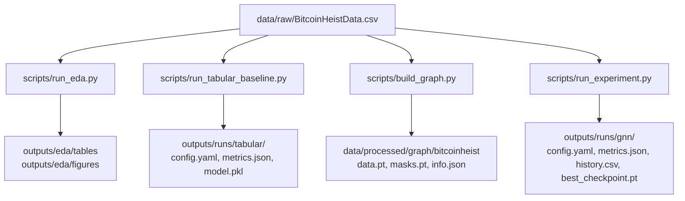

# Label-Efficient Bitcoin Fraud Detection

This repository is organized around two independent experiment paths that share the same raw BitcoinHeist CSV:

- Tabular ML baselines for quick signal checks before graph design.
- Graph/GNN experiments for graph construction, GNN training, and active learning.

Raw data is the source of truth:

```text
data/raw/BitcoinHeistData.csv
```

## Pipelines



## Common Commands

Install dependencies:

```powershell
pip install -r requirements.txt
```

Generate EDA artifacts:

```powershell
python scripts\run_eda.py
```

Run a tabular baseline:

```powershell
python scripts\run_tabular_baseline.py --config configs\pipeline\tabular_baseline.yaml
```

Build a graph artifact:

```powershell
python scripts\build_graph.py --config configs\pipeline\graph_build.yaml
```

Run a graph/GNN experiment:

```powershell
python scripts\run_experiment.py --config configs\pipeline\graph_experiment.yaml
```

Run a small mock smoke check:

```powershell
python scripts\validate_pipeline.py
```

## Current Design

Shared data logic lives in:

```text
src/data_layers/bitcoinheist_schema.py
src/data_layers/raw_loader.py
```

Tabular ML logic lives in:

```text
src/data_layers/tabular/preprocessing.py
src/tabular_ml/
```

Graph/GNN logic lives in:

```text
src/data_layers/datasets/
src/model_zoo/
src/execution_engine/
src/evaluation/
```

Run artifact management lives in:

```text
src/observability/run_manager.py
```
